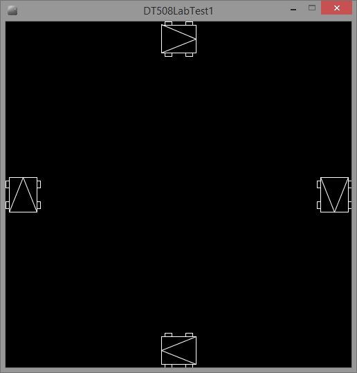

# DT508 Lab test 1

In this lab test you will be required to create a Processing sketch that looks like this:

In the scene, there are 4 car objects positioned around the edges of the screen. 

It may be animated to look like this:

You can solve this problem however you choose. However, you will get most marks in the test if you complete it as I suggest below as this is the way a Boss programmer (like me) would do it. Again I stress, this is my suggested way only and you are completely free to solve this test however you choose. Extra marks will be awarded for elegence and simplicity in the code, at my discression.

- Create a class called Car with fields for position and forward direction (PVectors) rotation (a float), w h (floats). w and h will determine the width and height of the car shapes. *(10 marks)*
- Create a constructor for the Car class that takes x, y, w and h as parameters and assigns these to the fields. *(10 marks)*
- Create a display method on the Car class that draws the car. You should probably use the pushMatrix/translate/rotate/popMatrix method we used last week, but feel free to come up with your own way. *(20 marks)*
- Create an ArrayList of Car types in the main sketch *(10 marks)*
- In setup, instiantiate 4 instances of the Car class with appropriate parameters. One for each car in the scene. Add these to the ArrayList *(15 marks)*
- In draw, iterate through the ArrayList and call the display method on each element. *(10 marks)*
- Create a move method on the Car class that calculates the forward vector from the theta field and moves the car in that direction. *(15 marks)*
- Add some if statements to check to see if the car position moves beyond the sides of the screen and adds HALF_PI radians to theta and resets the position.  *(10 marks)*
- If you did everything correctly, this will cause the car to move and rotate as per the video above.
- Make sure your name and student number are in every file you submit as a comment at the top of the file
- Comment your code so that even if you dont get something working, I can see what you were thinking.
- Zip up your project folder and submit everything through the link on Webcourses.

Good luck!