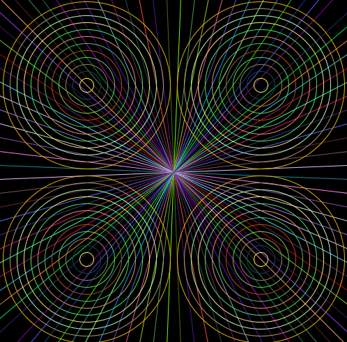

DT508 Programming
=================

Resources
---------
* [Christmas Assignment](Course/Assignment.md)
* [Processing](http://processing.org)
* [The Processing language reference](http://processing.org/reference/)
* [Learning Processing: A Beginner's Guide to Programming Images, Animation, and Interaction (Morgan Kaufmann Series in Computer Graphics)](http://http://www.learningprocessing.com/)
* [Khan Academy Programming Course (based on Processing!)](https://www.khanacademy.org/computing/cs)
* [The Nature of Code](http://natureofcode.com/)
* [Games Fleadh](http://www.gamesfleadh.ie/)
* [The Imagine Cup](https://www.imaginecup.com/)
* [How to use git](http://git-scm.com/documentation)
* [A video tutorial on git/github](https://www.youtube.com/watch?v=p_PGUltnB6w)

# Semester 2

## Week 7
- Assignment

## Week 6
- Lab Test

## Week 5
- [YASC WIP (With classes and an array list)](Processing Examples/YASCWIP)
- [Classes in processsing](https://processing.org/reference/class.html)
- [ArrayList in processing](https://processing.org/reference/ArrayList.html)

## Semester 1

Week 9
------

Week 8
------
* [BugZap](https://github.com/skooter500/BugZap)

Week 7
------

Week 6
------
* No class this week

Week 5
------
* [Arrays in Processing](https://www.processing.org/reference/Array.html)
* [Arrays in processing sketch](Processing Examples/Arrays)
* [Balloon Game](Processing Examples/BalloonGame)
* Homework - Make a proper game out of the BallonGame sketch
	*  Add lives - You loose a life when a balloon hits the top of the screen
	*  Add nice fonts and sounds
	*  Add a game over screen
	*  Add some progression, for example the ballons could get faster as the game progresses
	*  Submit your sketch through Google Classroom

Week 4
------
* [Perspective lines with a while loop sketch](Processing Examples/PerspectiveLinesWIthWhileLoop)
* [Smiley Face With Wallpaper nested for loops](Processing Examples/SmileyFaceWallpaper)
* Make this sketch for next week. Use the minimum number of loops and the minimum amount of code:

	

* I will give a prize for the best sketch. Feel free to add your own beautiful crazyness to the sketch
* Here are [some pictures of some geometric shapes](https://plus.google.com/photos/102641008582291248101/albums/6064398604152239873) you can make in Processing: 
* Please submit your sketches through http://classroom.google.com. Sign in using your DIT student email account and use the code s3n06gw

Week 3
------
* [Kite trigonometry problem](Processing Examples/KiteTriangleProblem)
* [Quadrants of the screen sketch](Processing Examples/Quadrants)
* [Ball bouncing back and forth sketch](Processing Examples/Ball)
* [Using sin and cos in a sketch](Processing Examples/Sine_waves)

Week 2
------
* [Trigonometry & the Unit Circle on the Khan Academy](https://www.khanacademy.org/math/trigonometry)
* [Maths is Fun Trigonometry](http://www.mathsisfun.com/sine-cosine-tangent.html)
* [Some trigonometry problems for you to try](Course/Trig Problems.md)
* [Lots of trigonometry practice problems](http://dtc.pima.edu/~hacker/primers/trigonometry-primer/trigonometry-primer-problem-set.pdf)
* [Data types in Processing & operations on variables](Processing Examples/Data Types)

Week 1
------
* [Introduction sketch](Processing Examples/Introduction)
* [Data types & operations in Processing sketch](Processing Examples/Data_types)

